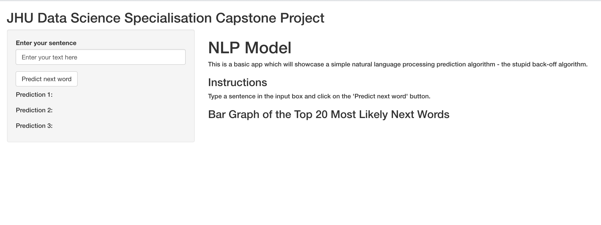
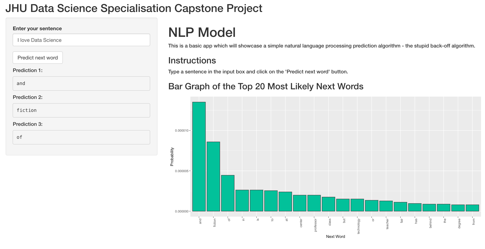

## Introduction

This presentation is part of the capstone project of the John Hopkins University Data Science Specialisation.

The Shiny application is [here](https://osrjh.shinyapps.io/DataScienceCapstone/).

The Shiny app code is [here](https://github.com/osrjh/Data-Science-Capstone/tree/main/DataScienceCapstone)

## How It Works

- The user types a sentence in the input box and clicks on the submit button.
- A stupid back-off algorithm is run to predict the most likely next words.
- Displays the top 3 predicted words in the side panel and a bar graph of the top 20.
- If the last 3 words of the sentence contain a common profanity, the predicted words will warn the user.

## Algorithm

- The model used to predict the next word is built using a stupid back-off algorithm.
- 25% of the aggregated corpus data was used to build the model.
- We calculate the probability of a word up to the previous three words in the sentence.
- If a four word combination does not exist in the corpus data, it will search through the three word combinations and continue to back down to one word combinations.
- This type of model is quite fast due to its simplicty but is not as accurate as a complex model which may be able to account for words outside of the corpus.

## App Layout
- The main panel has a brief summary and instructions on how to use the app. It also features the bar graph of the top 20 most likely next words.
- The side panel features an input box for the user to type in their sentence and the predicted words are displayed below the input box. 

